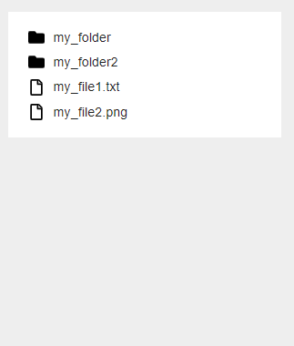

# staircase.js

*Version 1.5*

Small ajax sidebar file tree browser without dependencies.



## In short

- Vanilla JS
- Ajax driven
- Zero dependencies
- Small filesize
- Super simple setup
- Grouped files and folders
- Sorted files and folders
- Method support
- Callback support

## Setup

### CSS

Put the CSS within `<head></head>`.

```html
<link rel="stylesheet" href="assets/css/dist/staircase.min.css">
```

### HTML

Add the staircase selector to your html body like below.

```html
<body data-staircase-selector="stair-case">
```

Put the `stair-case` element within `<body></body>`. You also need to add the ajax url.

```html
<stair-case data-staircase-path="example/ajax/ajax.php"></stair-case>
```

### Javascript

Put the javascript before `</body>`. The script will then be autoloaded.

```html
<script src="assets/js/src/staircase.js"></script>
```

### Ajax

Ajax is used for getting files and folders from a parent. To demonstrate how it works I will use PHP.

Create an `ajax.php` file and put it in your root.

**Example**

```php
$post = json_decode(file_get_contents('php://input'), true);

$data = [
    'one.txt',
    'two/',
    'three/',
    'file.png'
];

echo json_encode($data);
```

- The first row with `$post` is needed to get the `$_POST` variables sent with ajax in PHP.
- The `$data` contains a list of files and folder.
- The `$data` should probably depend on what is inside your `$post`.
- To mark that it's a folder, just place a `/` at the end.
- The files and folders will be grouped and sorted alphabetically so you don't need to think about that.
- You need to print out the data as `json`.

If you want to see that something really is loading with ajax, you can put the code below inside your PHP file. It will delay the result by 0.25 seconds.

```php
usleep(250000);
```

## Callbacks

To use callbacks you need to create a class like below.

```js
class StaircaseCallbacks {
  load(params) {
    console.log(params);
  }
  toggle(params) {
    console.log(params);
  }
  select(params) {
    console.log(params);
  }
}
```

- `load` - Is only triggered when staircase is loaded
- `toggle` - Is triggered every time when a folder is clicked
- `select` - Is triggered every time you select a file or a folder

### Callback params

- `id` is the file or folder path, something like `myfolder/myfile.txt`.
- `element` is the closest list element which also contains additional data to extract.
- `type` is the type like `file` or `folder`.
- `state` is the state of the folder, `open` or `close`.
- `success` is a check if the ajax has been loaded correctly. It contains `true` or `false`.

## Methods

Be aware. These methods will not add any files or folders to the system. They will only add new visual items. It can be useful to populate the tree with them when using ajax.

```js
staircase.add(parent_id, new_name, type);
staircase.delete(id, type);

staircase.open(id);
staircase.close(id);

staircase.rename(id, new_name, type);

staircase.select(id, type);
staircase.deselect(id, type);

staircase.refresh(id);
```

### Methods variables

- `parent_id` - The parent id of `my/parent/current` would be `my/parent`
- `id` - The id is the path of the item, something like `my/folder/filename.txt`
- `type` - The type is `file` or `folder`
- `new_name` - A new name like `my_new_filename.txt`

### Methods explained

- `add` - Add a new item
- `delete` - Delete an item
- `open` - Opens a folder. It can also open a nested folder
- `close` - Closes a folder if it's open
- `rename` - Rename an item
- `select` - Select an item
- `deselect` - Deselect an item
- `refresh` - Refresh a folder and all it's sub contents

To see all possible params, visit [Mozilla - Fetch](https://developer.mozilla.org/en-US/docs/Web/API/Fetch_API/Using_Fetch#Supplying_request_options)

## Help appreciated

You you want to help me improve staircase.js?

**I'm specially interested in these things:**

- Bug fixes if you find any.
- Enhancements and improvements that makes already existing things a bit better.
- Pull requests or code in an issue. Both are equally fine.

## Icons

- Icons made by https://fontawesome.com

## Donate

Donate to [DevoneraAB](https://www.paypal.me/DevoneraAB) if you want.

## License

MIT