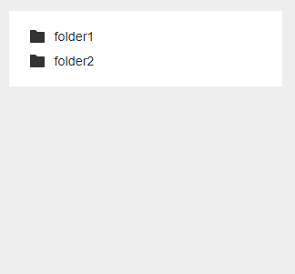

# staircase.js

*Version 1.2*

Small ajax sidebar file tree browser without dependencies.



## In short

- Vanilla JS
- Ajax driven
- Zero dependencies
- Very small filesize
- Super simple setup
- Grouped files and folders
- Sorted files and folders
- Callback support

## Setup

### CSS

Put the CSS within `<head></head>`.

```html
<link rel="stylesheet" href="assets/css/dist/staircase.min.css">
```

### HTML

Put a `stair-case` element within `<body></body>`. You can change the element name with an option.

```html
<stair-case></stair-case>
```

### Javascript

Put the javascript before `</body>`.

```html
<script src="assets/js/src/staircase.js"></script>
<script>
  staircase.init();
</script>
```

### Ajax

Ajax is used for getting files and folders from a parent. To demonstrate how it works I will use PHP.

Create an `ajax.php` file and put it in your root.

**Example**

```php
$post = json_decode(file_get_contents('php://input'), true);

$data = [
    'one.txt',
    'two/',
    'three/',
    'file.png'
];

echo json_encode($data);
```

- The first row with `$post` is needed to get the `$_POST` variables sent with ajax in PHP.
- The `$data` contains a list of files and folder.
- The `$data` should probably depend on what is inside your `$post`.
- To mark that it's a folder, just place a `/` at the end.
- The files and folders will be grouped and sorted alphabetically so you don't need to think about that.
- You need to print out the data as `json`.

If you want to see that something really is loading with ajax, you can put the code below inside your PHP file. It will delay the result by 0.25 seconds.

```php
usleep(250000);
```

## Options

All possible options in one go.

```js
staircase.init({
    ajaxPath: 'ajax.php',
    selector: 'stair-case',
    callbacks: {
        select: function(args) {
            console.log(args);
        },
        load: function(args) {
            console.log(args);
        },
        toggle: function(args) {
            console.log(args);
        }
    }
});
```

### ajaxPath

`ajaxPath` need a relative path to the ajax file.

### selector

By default you add the custom element `<stair-case></stair-case>` to your HTML. With the option `selector` you can change `stair-case` to another selector.

### callback - select

When you click a file or folder name it becomes active. If you add a callback function as an option you get access to some arguments.

**The `args` in this case contains these variables:**

- `id` is the file or folder path, something like `myfolder/myfile.txt`.
- `element` is the closest list element which also contains additional data to extract.
- `type` is the type like `file` or `folder`.

```js
staircase.init({
    callbacks: {
        select: function(args) {
            console.log(args);
        }
    }
});
```

### load

After a new list of files or folders has been loaded this callback is called if you have a function for it.

**The `args` in this case contains these variables:**

- `id` is the file or folder path, something like `myfolder/myfile.txt`.
- `element` is the closest list element which also contains additional data to extract.
- `success` is a check if the ajax has been loaded correctly. It contains `true` or `false`.

```js
staircase.init({
    callbacks: {
        load: function(args) {
            console.log(args);
        }
    }
});
```

### Toggle

When you toggle folders that has already been loaded, this callback is triggered.

**The `args` in this case contains these variables:**

- `id` is the file or folder path, something like `myfolder/myfile.txt`.
- `element` is the closest list element which also contains additional data to extract.
- `type` is the type like `file` or `folder`.
- `state` is the state of the folder, `open` or `close`.

```js
staircase.init({
    callbacks: {
        toggle: function(args) {
            console.log(args);
        }
    }
});
```

### fetchParams

For edge cases and security, you may need to change the fetch params.

```js
staircase.init({
    fetchParams: {
        method: 'POST',
        headers: {
            'Content-Type': 'application/json',
        }
    }
});
```

To see all possible params, visit [Mozilla - Fetch](https://developer.mozilla.org/en-US/docs/Web/API/Fetch_API/Using_Fetch#Supplying_request_options)

## Help appreciated

You you want to help me improve staircase.js?

**I'm specially interested in these things:**

- Bug fixes if you find any.
- Enhancements and improvements that makes already existing things a bit better.
- Pull requests or code in an issue. Both are equally fine.

## Icons

- Icons made by https://fontawesome.com

## Donate

Donate to [DevoneraAB](https://www.paypal.me/DevoneraAB) if you want.

## License

MIT